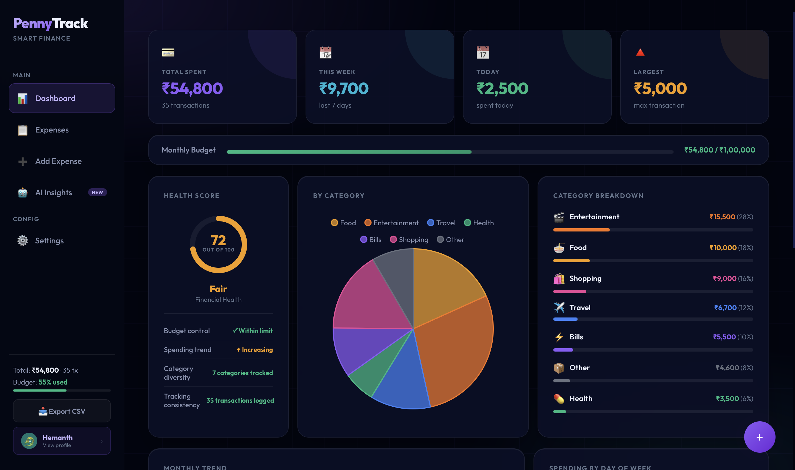
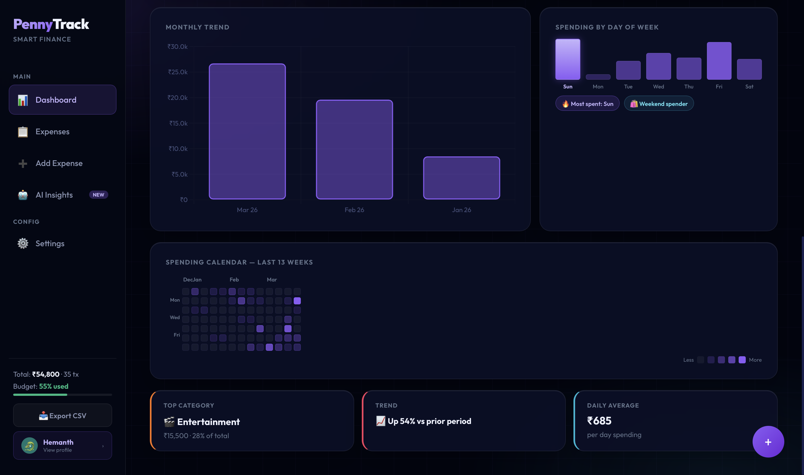
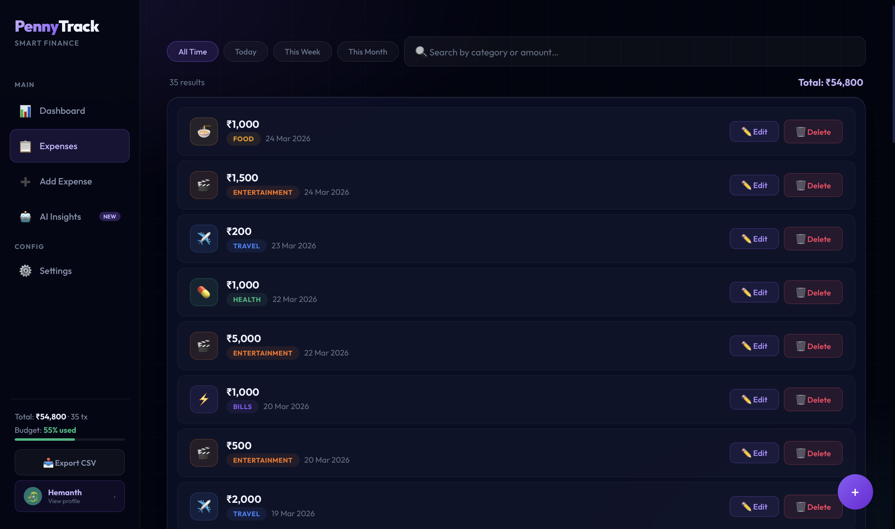
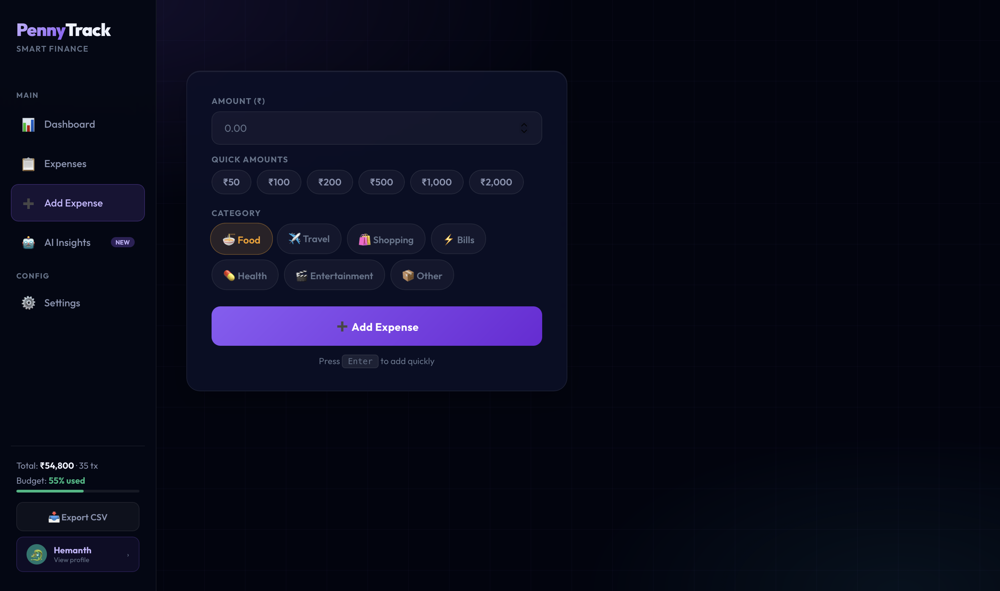
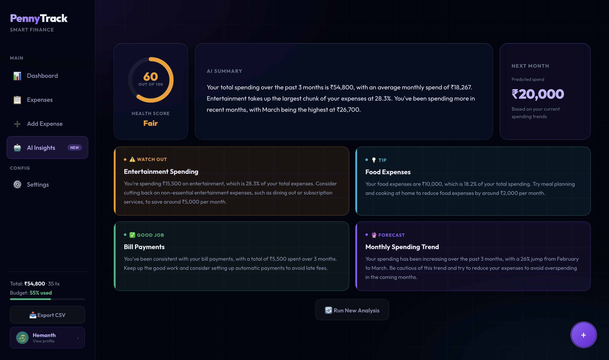
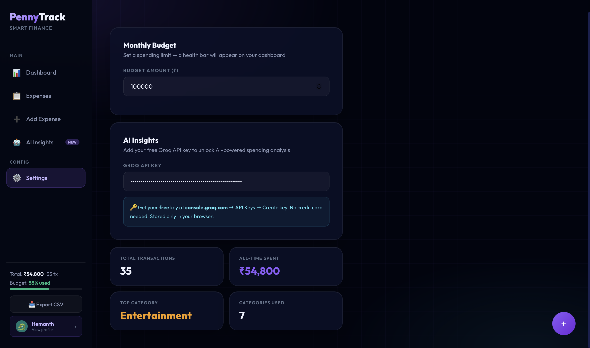
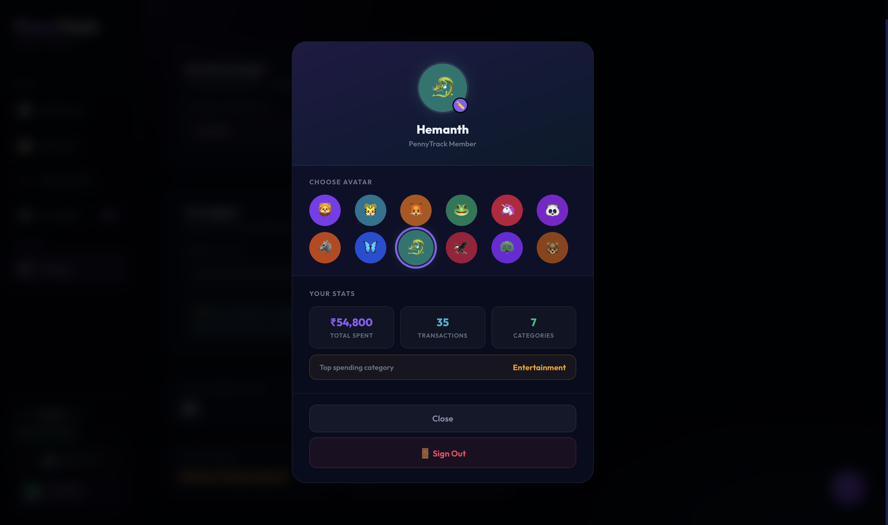

# 📊 PennyTrack – Smart Expense Tracker

A modern full-stack expense tracking application built with React and Django REST Framework.  
Track your spending, analyze trends, and gain insights into your financial habits.

---

## Features

- Dashboard with analytics
- Add / Edit / Delete expenses
- Budget tracking with progress indicator
- Charts & spending insights
- AI-powered insights (Groq integration)
- JWT Authentication (Login/Register)
- Profile & avatar system
- Export data as CSV
- Fully responsive UI

---

## Tech Stack

**Frontend**
- React.js
- Chart.js
- Axios

**Backend**
- Django
- Django REST Framework
- JWT Authentication

---

## Project Structure

```
penny_track/
├── backend/     # Django backend (API)
└── frontend/    # React frontend (UI)
```

---

## Setup Instructions

### Backend

```bash
cd backend
pip install -r requirements.txt
python manage.py migrate
python manage.py runserver
```

### Frontend
```bash
cd frontend
npm install
npm start
```

---

## Environment Variables

### Backend

SECRET_KEY = your_secret_key

### Frontend

REACT_APP_API_KEY = your_api_key

---

## Screenshots

### Dashboard


### Dashboard


### Expenses


### Add Expense


### AI Insights


### Settings


### Profile

